# Product Requirements Document (PRD)

## Project: SISFODES (Sistem Informasi Desa - Sumberkejayan)

---

## 1. Document Control

- **Owner**: ANTARDATA CAKRAWALA TEKNOLOGI
- **Status**: Draft / Active Reference
- **Version**: 1.0.0
- **Target Audience**: AI Agents, Frontend Developers, Project Managers, Village Administrators

---

## 2. Product Overview & Purpose

SISFODES (Sistem Informasi Desa) is a comprehensive web portal designed for the village of **Sumberkejayan**. It acts as a digital bridge between the village administration and its citizens.

The primary goals of the platform are:

1. **Transparency**: To make village finances (APBDes), planning (RKPDes, RPJMDes), and demographic statistics accessible to the public.
2. **Efficiency**: To digitize public service requests, enabling citizens to request letters/certificates and file complaints online.
3. **Information Hub**: To broadcast official news, articles, agendas, and achievements.
4. **Economic Support**: To promote local Micro, Small, and Medium Enterprises (MSMEs/UMKM) by showcasing village products.

---

## 3. Core Principles & Philosophy

- **Performance First**: The application must be extremely lightweight, ensuring fast load times even on slow 3G/4G networks in rural areas.
- **Accessibility & Mobile-Friendliness**: The interface must adapt perfectly to mobile devices, as the majority of village users access the portal via smartphones.
- **Security**: Strict validation of form inputs and secure data handling to protect citizens' personal details.

---

## 4. User Personas

### 4.1. Village Citizen (Warga)

- **Profile**: A local resident who wants to access public services, submit administrative requests, read local news, or report a neighborhood issue.
- **Needs**:
    - Quick access to administrative letter templates (Domisili, Kehilangan, etc.).
    - A clean, easy-to-use complaint submission form.
    - Transparent information about village developments and budgets.
    - Mobile-responsive layout that runs smoothly on budget Android devices.

### 4.2. General Public / Visitor (Pengunjung Umum)

- **Profile**: Someone from outside the village interested in local tourism, culture, or purchasing products from village MSMEs.
- **Needs**:
    - Easy navigation through village history, profiles, and geography.
    - Clear catalog of village MSME products with seller contact details.
    - Media gallery showcasing village activities.

### 4.3. Village Administrator / Agent (Admin Desa)

- **Profile**: Village officials responsible for updates, uploading documents, reviewing citizen requests, and managing complaints.
- **Needs**:
    - Robust backend connection to update static content (news, events, officials).
    - Secure and reliable forms that submit data correctly to the administrative database.

---

## 5. Functional Scope & Features

The application is structured into several core modules:

```mermaid
graph TD
    A[SISFODES Portal] --> B[Profil Desa]
    A --> C[Layanan Publik]
    A --> D[Publikasi & Transparansi]
    A --> E[Statistik & Kependudukan]
    A --> F[Informasi & Berita]
    A --> G[Potensi & UMKM]
    A --> H[Galeri & Pengaduan]

    B --> B1[Visi Misi & Profil]
    B --> B2[Struktur Organisasi]
    B --> B3[Geografi & Peta Desa]
    B --> B4[Fasilitas Umum]

    C --> C1[Surat Domisili]
    C --> C2[Surat Kehilangan]
    C --> C3[Surat Tidak Mampu]
    C --> C4[Surat Pindah Kawin]

    D --> D1[APBDes & RAPBDes]
    D --> D2[RPJMDes & RKPDes]
    D --> D3[Bank Data]

    E --> E1[Indeks Desa Membangun IDM]
    E --> E2[SDGs Desa]
    E --> E3[Demografi Penduduk]

    F --> F1[Berita & Artikel]
    F --> F2[Agenda & Pengumuman]
    F --> F3[Penghargaan]

    G --> G1[Katalog Produk Desa]
```

### 5.1. Profile Module (Profil Desa)

- **Profil Desa**: Detailed background, history, and vision-mission statements of Sumberkejayan.
- **Struktur Organisasi**: Interactive charts/carousels representing the village apparatus and officials.
- **Geografi & Peta Desa**: Display geographical limits and an interactive map showing village borders.
- **Fasilitas Umum**: Directory of schools, mosques, health clinics, and other public facilities.

### 5.2. Public Services Module (Layanan Publik)

- **Online Certificates**: Digital forms for citizens to submit data for:
    - _Surat Keterangan Domisili_ (Residency Certificate)
    - _Surat Keterangan Kehilangan_ (Lost Item Certificate)
    - _Surat Keterangan Tidak Mampu - SKTM_ (Financial Assistance Certificate)
    - _Surat Keterangan Pindah Kawin_ (Marriage Relocation Certificate)
- **Complaints (Pengaduan)**: A public form to submit complaints, reports, or feedback regarding village infrastructure/services, along with a tracking view of submitted complaints.

### 5.3. Publication & Transparency Module (Publikasi)

- **Budget Transparency**: Interactive representations of APBDes (Anggaran Pendapatan dan Belanja Desa) and RAPBDes, showing revenue, spending, and execution status.
- **Village Planning**: Documents such as RKPDes (Rencana Kerja Pemerintah Desa) and RPJMDes (Rencana Pembangunan Jangka Menengah Desa).
- **Bank Data**: File repository for downloading public regulations, reports, and templates.

### 5.4. Statistics Module (Statistik)

- **IDM (Indeks Desa Membangun)**: Metrics showing the development index status of the village.
- **SDGs Desa**: Achievement statistics for the United Nations SDGs mapped locally to the village level.
- **Demography**: Dynamic data representation (gender ratios, age distribution, occupations, religions) using graphical charts.

### 5.5. Information Module (Informasi)

- **Berita & Artikel**: Regular updates on village activities, announcements, and educational articles.
- **Agenda**: Calendar events, town halls, vaccination drives, and announcements with active countdowns where relevant.
- **Penghargaan**: Showcase of awards and recognitions received by the village.

### 5.6. Village Potential Module (Potensi Desa)

- **Katalog Produk Desa**: Showcase of local village products, promoting MSMEs by providing details and direct links/contact info to purchase from the sellers.

---

## 6. Non-Functional Requirements (NFR)

- **Lighthouse Scores**:
    - Performance: ≥ 90 (Objective: 99 via memoization, lazy loading, optimized images).
    - Accessibility: 100 (Clean ARIA properties, keyboard navigability).
    - SEO: 100 (Semantic tags, unique title & description metadata per route).
- **Device Support**: Mobile-first responsive design, optimized for screen sizes starting from 320px width.
- **SSR Safety**: The frontend is built on TanStack Start; all custom scripts must be SSR-safe, handling window/document objects only after mounting or within client-only sections.
- **Data Security**: Citizen application forms must perform robust schema validation on the client side using Zod and react-form before sending data to server endpoints.

---

## 7. Product Roadmap & Future Stages

1. **Phase 1: Mock Integration (Current)**:
    - Develop frontend layout, components, and static mock API structure using local datasets.
2. **Phase 2: Live Backend Integration**:
    - Establish live backend connection, changing local routes to fetch from real REST APIs.
    - Centralize query key structures.
3. **Phase 3: Administrative Dashboard**:
    - Create an admin panel for village officials to approve certificates, reply to complaints, and publish news articles.
    - Secure and manage authentication.
4. **Phase 4: Advanced Notifications**:
    - Connect request status updates to WhatsApp/SMS APIs so citizens receive notifications directly on their phones.
