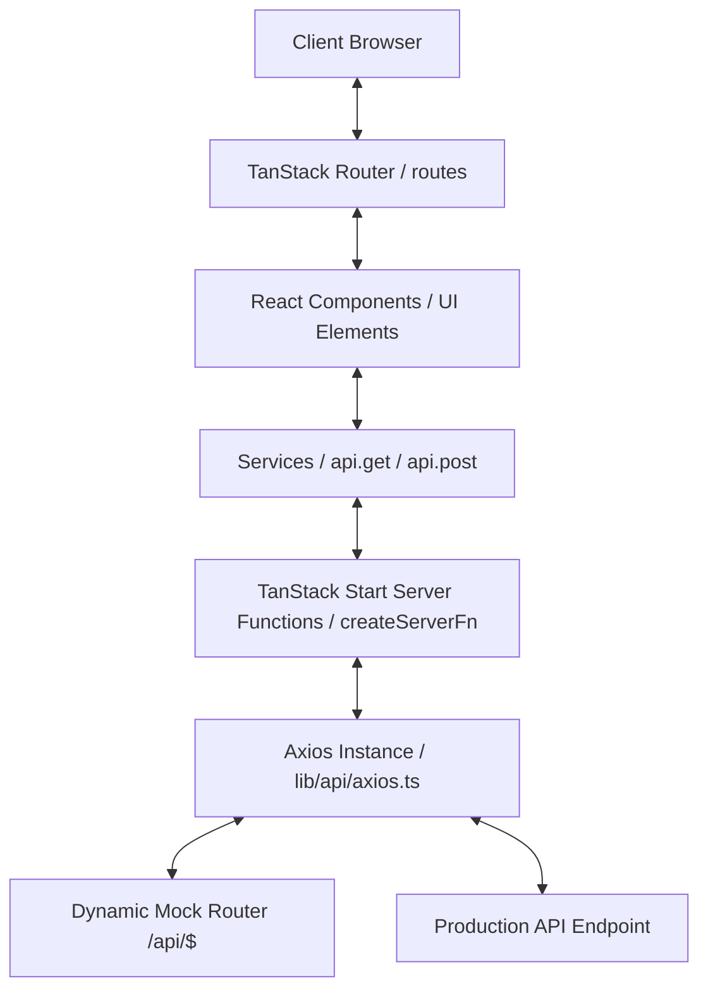

# Software Requirements Specification (SRS)

## Project: SISFODES (Sistem Informasi Desa - Sumberkejayan)

---

## 1. Introduction

### 1.1. Purpose

This document provides a comprehensive technical specification of the SISFODES frontend portal. It specifies functional and non-functional engineering requirements, software architectures, configurations, coding standards, and deployment parameters.

### 1.2. Scope

This specification covers the React/TypeScript frontend application constructed using **TanStack Start**. It details routing, services, state management, layouts, components, mock API configuration, styling, and testing strategies.

---

## 2. Overall Description

### 2.1. System Overview

SISFODES is structured as a Server-Side Rendered (SSR) web application utilizing TanStack Start, which runs on top of Vite and Nitro server engines. The system acts as a Single Page Application (SPA) after initial load, offering instant, smooth client-side routing.

### 2.2. Product Functions & Architecture



### 2.3. System Environment & Tech Stack

- **Framework**: TanStack Start (v1.x) with TanStack Router
- **Runtime Environment**: Node.js (v18.x / v20.x / v22.x)
- **Programming Language**: TypeScript (v5.x)
- **Build Tool**: Vite (v8.x) & Nitro (v3.x)
- **Styling**: Tailwind CSS (v4)
- **Visualizations**: Recharts (v3) for demographic/financial data
- **Maps**: Leaflet (v1.9) & React-Leaflet (v5)
- **State Management**: TanStack Query (v5) & TanStack Store (v1)
- **Form Management**: TanStack Form & Zod
- **Testing**: Vitest, React Testing Library, JSDOM

---

## 3. Directory & Folder Architecture

All source code is mapped within the `src/` directory as follows:

```
src/
├── assets/         # Static media, images, and brand assets (must be imported in code)
├── components/     # Reusable structural and UI components
│   ├── layout/     # Structural wrappers (Header, Footer, MobileMenu, page sections)
│   ├── shared/     # Modular molecules (Cards, Custom Carousels, Custom Charts, Map wrappers)
│   └── ui/         # Shadcn UI base primitives (Button, Card, Input, Textarea, etc.)
├── constant/       # Global constants, static configuration, menu options, and endpoints
├── data/           # Structured mock data (in .ts / .json format)
├── hooks/          # Shared custom React Hooks
├── integrations/   # Third-party integrations (e.g. Supabase, Map services)
├── lib/            # Shared libraries configuration
│   └── api/        # Axios configuration and error interceptors
├── routes/         # File-based routing definitions
│   ├── api/        # Local mock endpoints (/api/$)
│   └── ...         # Page route components
├── services/       # Query options, server functions (createServerFn), and API requests
├── types/          # Centralized TypeScript interface files
├── utils/          # Standalone utilities (date formatting, validators, API helpers)
├── env.ts          # Type-safe environment variables validation (T3Env)
├── router.tsx      # Router registry and initialization
└── styles.css      # Global Tailwind styling configurations
```

---

## 4. Detailed Component & Routing Requirements

### 4.1. Routing Registry

All routes are managed dynamically based on files in `src/routes/` and compiled inside `src/routeTree.gen.ts`.

| Path                          | File Location                               | Dynamic Params | Purpose                                                   |
| ----------------------------- | ------------------------------------------- | -------------- | --------------------------------------------------------- |
| `/`                           | `src/routes/index.tsx`                      | None           | Home portal showing summary widgets                       |
| `/profil/profil-desa`         | `src/routes/profil/profil-desa.tsx`         | None           | General village profile and description                   |
| `/profil/struktur-organisasi` | `src/routes/profil/struktur-organisasi.tsx` | None           | Village structural layout and officials list              |
| `/profil/geografi-desa`       | `src/routes/profil/geografi-desa.tsx`       | None           | Village geography information                             |
| `/profil/fasilitas-umum`      | `src/routes/profil/fasilitas-umum.tsx`      | None           | Public amenities list and markers                         |
| `/profil/peta-desa`           | `src/routes/profil/peta-desa.tsx`           | None           | Interactive map visualizer with village borders           |
| `/lembaga/$slug`              | `src/routes/lembaga/$slug.tsx`              | `slug`         | Dynamic pages detailing village organizations             |
| `/statistik/idm`              | `src/routes/statistik/idm.tsx`              | None           | Indeks Desa Membangun details                             |
| `/statistik/kependudukan`     | `src/routes/statistik/kependudukan.tsx`     | None           | Demographic charts                                        |
| `/statistik/sdgs`             | `src/routes/statistik/sdgs.tsx`             | None           | Sustainable development milestones                        |
| `/layanan/{type}`             | `src/routes/layanan/*.tsx`                  | None           | Form submission for residency, missing items, etc.        |
| `/informasi/berita`           | `src/routes/informasi/berita/index.tsx`     | None           | Paginated village news repository                         |
| `/informasi/berita/$slug`     | `src/routes/informasi/berita/$slug.tsx`     | `slug`         | Detailed view for village news articles                   |
| `/produk`                     | `src/routes/produk/index.tsx`               | None           | Showcase list of village MSMEs products                   |
| `/produk/$slug`               | `src/routes/produk/$slug.tsx`               | `slug`         | Detail view of a village MSME product                     |
| `/galeri`                     | `src/routes/galeri.tsx`                     | None           | Layout showing images/videos of village events            |
| `/pengaduan`                  | `src/routes/pengaduan.tsx`                  | None           | Form to lodge reports and see past complaints             |
| `/api/$`                      | `src/routes/api/$.ts`                       | `_splat`       | Dynamic mock endpoint processing all requests to `/api/*` |

### 4.2. Local Mock Server Interception (`/api/$`)

The route `src/routes/api/$.ts` parses `params._splat` to extract the requested collection name and resource identifier (e.g. `/api/news/judul-berita` -> collection: `news`, slug: `judul-berita`).

- Standard response wraps return objects using a static helper `ApiResponse` (`src/utils/apiResponse.util.ts`).
- Successful returns are wrapped with:
    ```json
    {
      "metadata": { "code": 200, "message": "Success message" },
      "response": { ... }
    }
    ```
- Errors return standard:
    ```json
    {
        "metadata": { "code": 404, "message": "Error details" },
        "response": null
    }
    ```

---

## 5. Coding & Quality Standards

### 5.1. Naming & Formatting Conventions

- **Indentation**: 2 spaces.
- **Naming Convention**:
    - `camelCase` for variables, helper functions, and instances.
    - `PascalCase` for React components, Page Routes, types, and interfaces.
- **Strict Checks**: Must use `===` and `!==` for equality evaluations.
- **Optimization**: Heavy calculation functions or array iterations must be optimized using `useMemo` and event handlers/callbacks using `useCallback`.
- **Documentation**: All public files, hooks, utilities, and components must feature standard JSDoc:
    ```typescript
    /**
     * @description Summarizes the function's objective
     * @param {Type} paramName - Describes parameter usage
     * @returns {Type} Describes return value
     * @example
     * functionCall(paramVal);
     */
    ```

### 5.2. Testing Architecture

- Unit tests must be placed in `src/test/logic/` for business logic, loaders, calculations, and custom hooks.
- Integration/visual tests must be placed in `src/test/ui/` to verify layout structural trees, accessibility attributes, and component renderings.
- Tests are run using `vitest`. Target a clean pass rate and run coverage check using:
    ```bash
    npm run test:coverage
    ```

---

## 6. Non-Functional Software Requirements

### 6.1. Accessibility (A11y)

- Standard HTML5 semantic structure must be followed (`<main>`, `<header>`, `<footer>`, `<section>`).
- Image elements must feature descriptive `alt` tags.
- Loading indicator components and skeletons must declare `aria-busy="true"` and `aria-label="Loading content"`.
- Forms must associate descriptive `<label>` tags with their respective input elements using `htmlFor` attributes.

### 6.2. SEO Integration

- Each page must register an independent meta tag head generator defining:
    - Title Tag (Formatted as `[Page Title] | Desa Sumberkejayan`)
    - Meta Description (Dynamic excerpt or custom page description)
    - Layout-level viewport and charset configurations within `src/routes/__root.tsx`.

### 6.3. Performance & Load Time Optimization

- Visual elements below the fold must use React `Suspense` and `lazy` imports to minimize the initial JS bundle size.
- Product listings and news lists should implement pagination or virtual listing where appropriate to limit DOM size.
- Ensure all remote image loaders integrate with `@unpic/react` to enforce auto-resized and responsive image sources.
